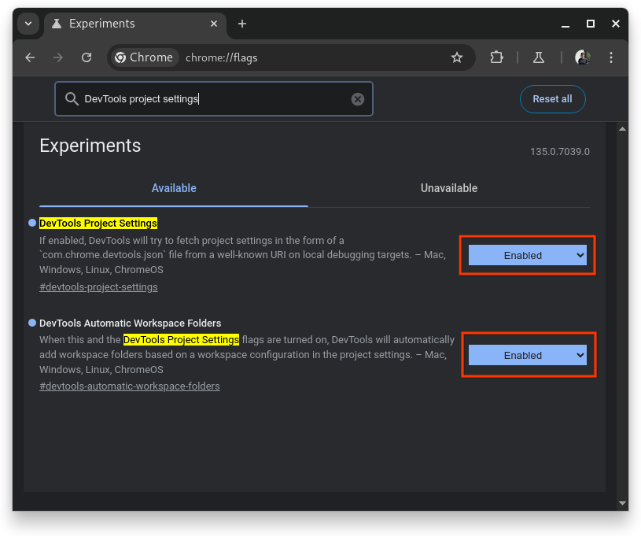

# Automatic Workspace Folders

[goo.gle/devtools-automatic-workspace-folders][self-link]

We recently added a new feature to Chromium (available with M-135 and later),
which improves the ergonomics and discoverability of the [Workspace] feature,
and it's called "Automatic Workspace Folders".

**Googlers-only:** Check out the internal resources at

-   [go/chrome-devtools:automatic-workspace-folders-design][design-doc], and
-   [go/chrome-devtools:automatic-workspace-folders-demo][demo].

## Background

The [Workspace][workspace-doc] feature, which was originally (re)launched as
[Workspaces 2.0][workspace-announcement] in M-63 and announced at CDS 2016,
allows developers to edit and save files in your project, effectively persisting
changes that you make in DevTools (during debugging) to your source files
directly. However, as outlined in the documentation this requires quite a bit of
[manual setup](https://developer.chrome.com/docs/devtools/workspaces#devtools),
which is

1.  not particularly obvious and discoverable, and
2.  not very ergonomic when working on different projects.

Specifically the second point is problematic, as you have to manually maintain
the list of folders in your workspace, meaning that whenever you work on a new
project (or just a separate checkout of an existing project) you'd need to add
the relevant folder manually via the Workspace tab, and when you're done with a
project (at least for a while) you'd need to remove it explicitly from the list
(otherwise the list will soon grow very long).

## Solution

With M-135 we've added a feature called "Automatic Workspace Folders", where
devservers can inform the developer tools running in the browser about the
project folders that they are serving, and DevTools can automatically pick that
up and connect to these folders during local debugging, and automatically
disconnect these folders when the developer navigates somewhere else.

This information is communicated via a special JSON file that DevTools requests
from a well-known location on the devserver, as outlined in the
[DevTools Project Settings (devtools.json)][design-doc-json]. The file is named
`com.chrome.devtools.json` (for now) and located in the
`/.well-known/appspecific/` folder of the inspected page. For the automatic
workspace folders, it has to contain a `workspace` object with two properties:

-   `workspace.root` is the absolute path to the project folder (where the
    source code is located).
-   `workspace.uuid` is a valid UUID, ideally a v4 UUID, generated randomly when
    setting up the project folder.

An example `com.chrome.devtools.json` would look like this:

```
{
  "workspace": {
    "root": "/Users/foobar/Projects/my-awesome-web-project",
    "uuid": "53b029bb-c989-4dca-969b-835fecec3717"
  }
}
```

Chromium DevTools will only attempt to load the `com.chrome.devtools.json` when
the origin of the inspected page is `localhost`.

## Setup

In M-135, which is in Canary channel at the time of this writing, and probably
M-136 too, this feature is disabled by default. To use it, you need to turn on
two feature flags in `about:flags`:

-   [chrome://flags#devtools-project-settings](chrome://flags#devtools-project-settings)
-   [chrome://flags#devtools-automatic-workspace-folders](chrome://flags#devtools-automatic-workspace-folders)



Instead of enabling the feature via `about:flags`, you can instead also enable
them from the command line:

```
google-chrome-canary--enable-features=DevToolsWellKnown,DevToolsAutomaticFileSystems
```

To check if your setup is correct, you can try out my [Hello World][hello-world]
demo project. Just follow the steps outlined in the `README.md` there.

[self-link]: http://goo.gle/devtools-automatic-workspace-folders
[design-doc]: http://go/chrome-devtools:automatic-workspace-folders-design
[demo]: http://go/chrome-devtools:automatic-workspace-folders-demo
[workspace-doc]: https://developer.chrome.com/docs/devtools/workspaces
[workspaces-announcement]: https://developer.chrome.com/blog/new-in-devtools-63#workspaces
[design-doc-json]: https://goo.gle/devtools-json-design
[hello-world]: https://github.com/bmeurer/automatic-workspace-folders-hello-world
